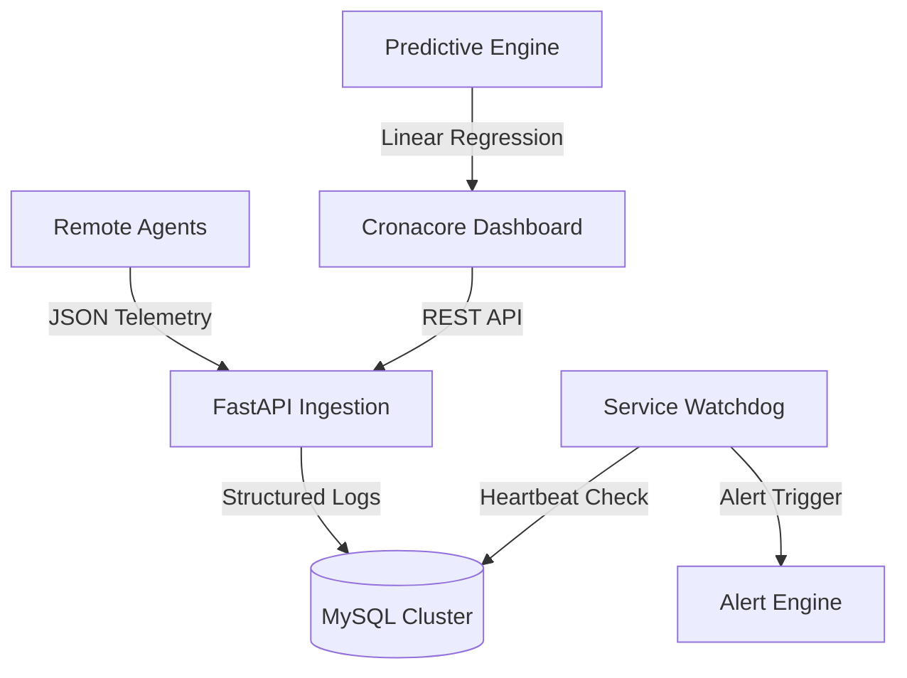

# 🛡️ Cronacore | The Core of System Observability

<div align="center">
  
  
  
  
  
</div>

---

**Cronacore** is a production-hardened observability platform designed for real-time telemetry ingestion, anomaly detection, and predictive forecasting. It features a professional **"Deep Enterprise Tech"** aesthetic, shimmering interactive branding, and a resilient distributed architecture.

## 🏗️ System Architecture



## ✨ Key Features
- **Exquisite Real-Time Dashboard**: High-contrast, emerald-on-slate design with shimmering branding, custom sleek scrollbars, and staggered entry animations.
- **AI-Powered Forecasting**: Predictive analytics that forecast resource exhaustion (CPU/Disk/Memory) using linear regression models.
- **Automated Anomaly Detection**: Real-time detection of performance spikes and system deviations with visualized score chips.
- **Distributed Agent Monitoring**: Built-in **Service Watchdog** tracks agent heartbeats and flags offline or unstable services instantly.
- **High-Fidelity Visuals**: Advanced Recharts implementation with gradient area surfaces and custom "Glass-Dark" tooltips.
- **Docker-First Infrastructure**: Fully containerized stack for seamless, repeatable deployment across any environment.

## 🚀 Quick Start (Production Mode)

Ensure you have **Docker** installed, then run:

```bash
# Clone the repository
git clone https://github.com/Akash04471/SystemHealthAndPerformanceMonitoringDashboard.git

# Enter the project
cd SystemHealthAndPerformanceMonitoringDashboard

# Launch the full stack
docker-compose up --build -d
```

Access the dashboard at **`http://localhost:8080`**
- **Default User**: `admin@example.com`
- **Default Pass**: `admin123`

## 🛠️ Tech Stack
- **Backend**: Python 3.9+, FastAPI, SQLAlchemy, MySQL
- **Frontend**: React 18, Recharts, Vanilla CSS (Token-based)
- **Monitoring**: Custom Watchdog Service, Heartbeat Ingestion API
- **Deployment**: Docker, Docker Compose, Nginx Proxy

---

<div align="center">
  <p>Built with ❤️ by <b>Akash</b></p>
</div>
